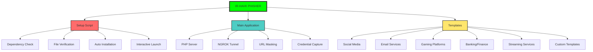
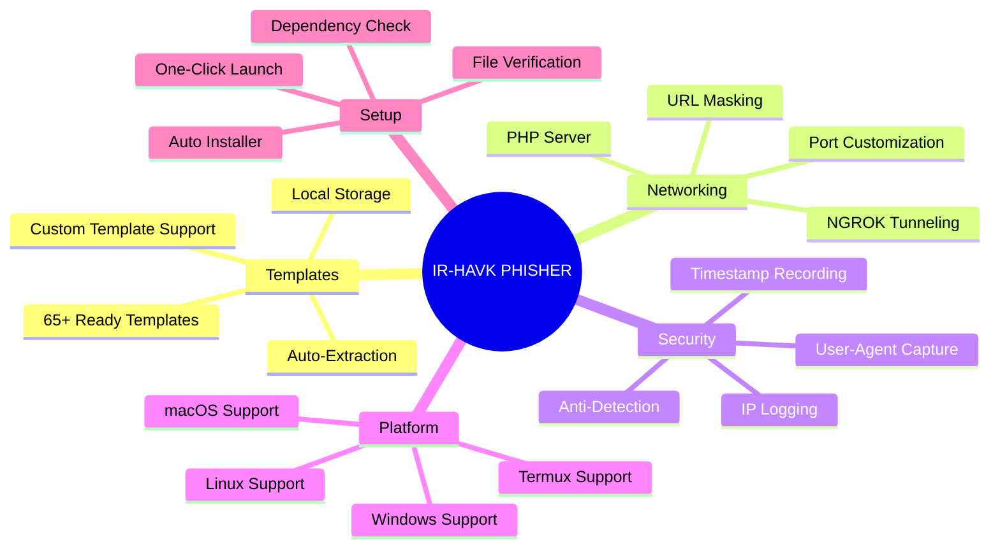
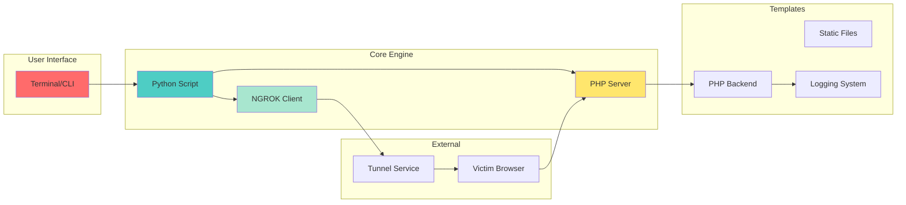
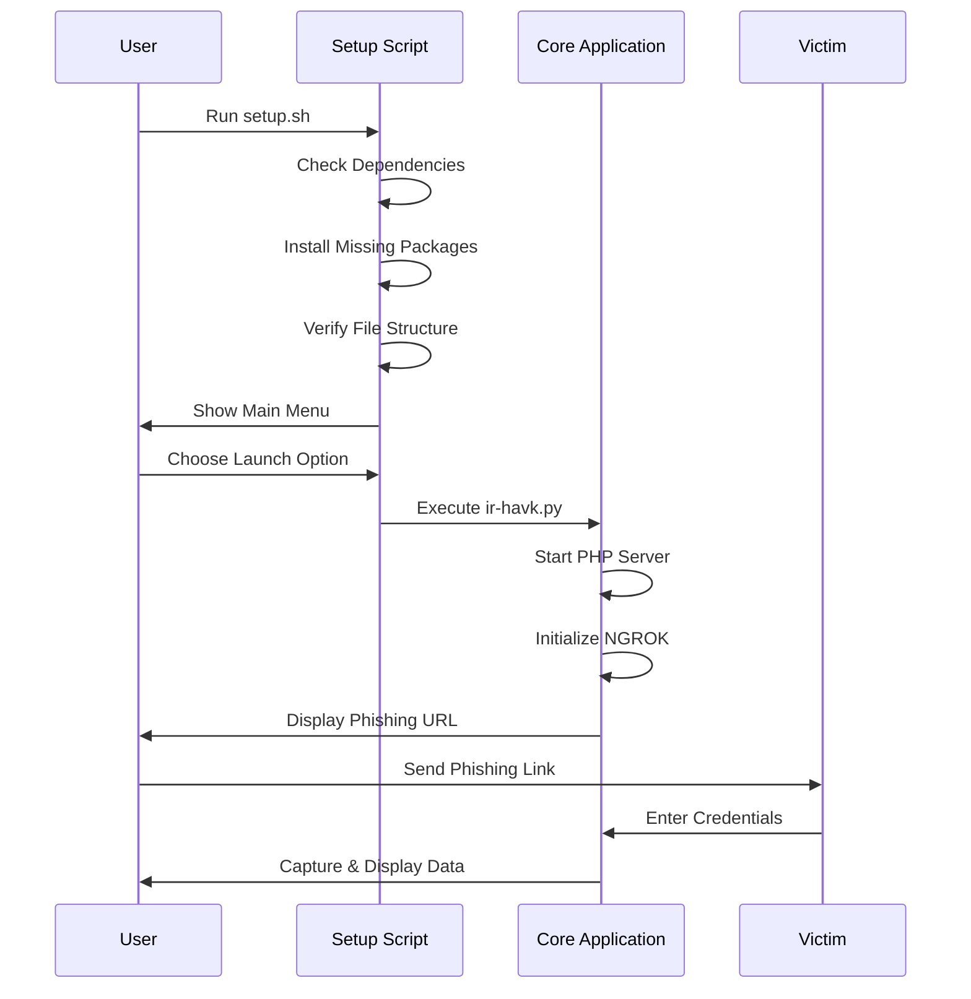
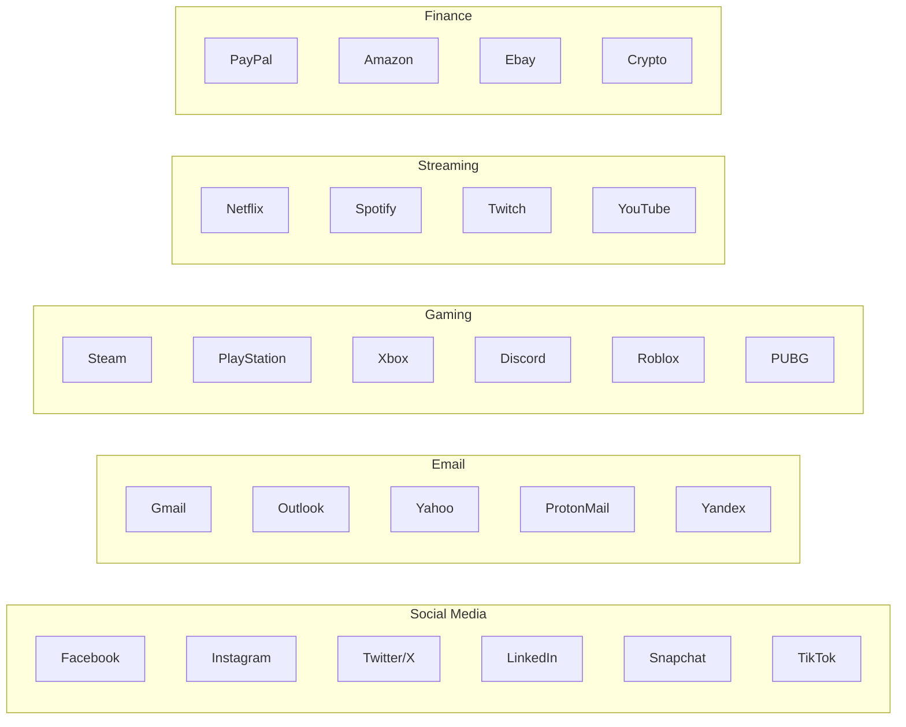
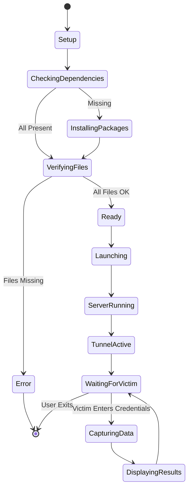
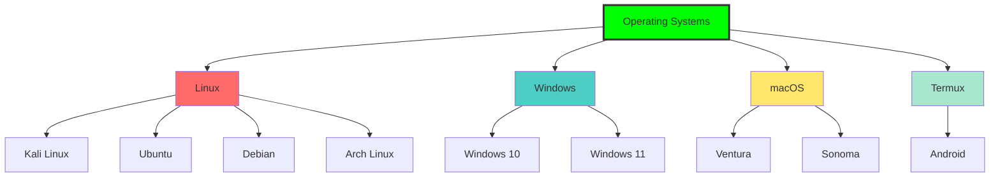
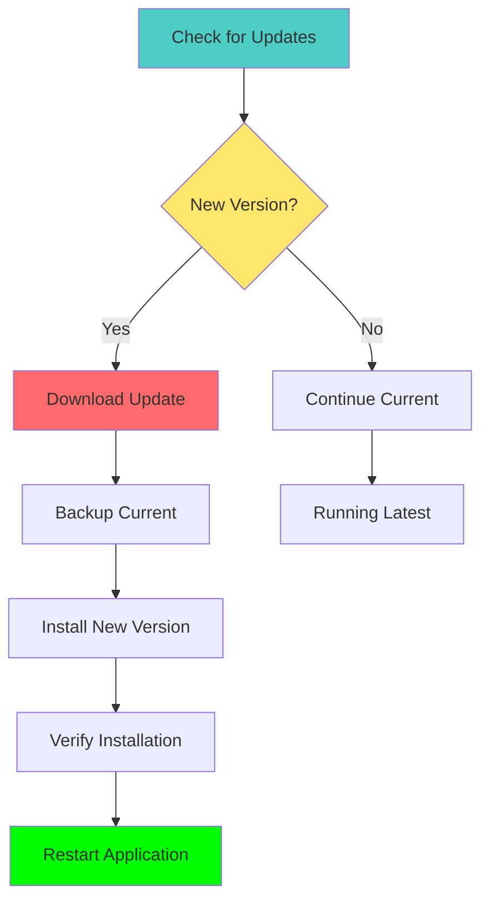

<!-- IR-HAVK PHISHER README -->
<!-- Created by ATHEX BLACK HAT -->

<p align="center">
  
</p>

<p align="center">
  <a href="https://github.com/Athexblackhat/ir-havk_phisher">
    
  </a>
  <a href="https://www.python.org/">
    
  </a>
  <a href="https://www.php.net/">
    
  </a>
  <a href="https://www.linux.org/">
    
  </a>
  <a href="https://www.microsoft.com/windows">
    
  </a>
  <a href="https://www.apple.com/macos/">
    
  </a>
  <a href="LICENSE">
    
  </a>
</p>

<p align="center">
  
  
  
</p>

<br/>

<p align="center">
  
</p>

---

<div align="center">

# ⚡ IR-HAVK PHISHER ⚡

### *The Ultimate Phishing Tool for Security Professionals & CTF Enthusiasts*

[](https://git.io/typing-svg)

</div>

---

## 📊 Project Overview



## 🎯 Features


## 🏗️ Architecture



## 🚀 Quick Start



## 📦 Installation
```
git clone https://github.com/Athexblackhat/ir-havk_phisher.git

cd ir-havk_phisher

chmod +x setup.sh
```
## Run the automated setup
```
./setup.sh
```

## Manual SetUp
```
git clone https://github.com/Athexblackhat/ir-havk_phisher.git

cd ir-havk_phisher

sudo apt update && sudo apt install -y php curl wget unzip git

python3 ir-havk.py
```

## 🎮 Available Templates

## 🔧 Configuration
Port Configuration

### Default port 8080
python3 ir-havk.py

### Custom port
python3 ir-havk.py -p 8888

### With template selection
python3 ir-havk.py -p 8080 -o 1
Template Customization
Edit files/templates.json to add custom templates:

json
{
    "name": "Your Template",
    "choice": "99",
    "folder": "custom_folder",
    "mask": "https://your-mask-url.com"
}
## Workflow


## 🌐 Cross-Platform Support


## 🔄 Update Process


## [!CAUTION]
The developer is not responsible for any misuse of this tool. Use at your own risk and only on systems you own or have explicit permission to test.

<div align="center">
💖 Support This Project
<p> <a href="https://github.com/Athexblackhat/ir-havk_phisher">  </a> <a href="https://github.com/Athexblackhat/ir-havk_phisher/fork">  </a> <a href="https://github.com/Athexblackhat/ir-havk_phisher/issues">  </a> </p>
Made with ❤️ by ATHEX BLACK HAT
<p>  </p></div> ```


